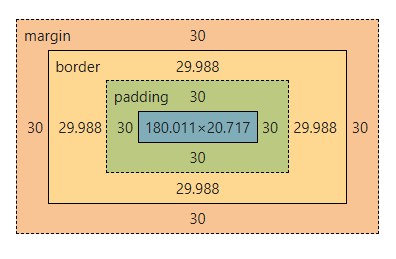

### box-sizing 속성이 뭘까?

퍼블리싱 작업을 할 때, 박스의 `width` 와 `height`를 지정하는 작업을 수 없이 많이 해봤다. 박스를 구성하는 것에는  `요소 자체 크기` + `padding` + `border` + `margin` 이 있다. 

하지만 `width` 와 `height` 에 어디까지 포함되는 것인지 순간 헷갈렸다.

이와 같이 박스의 크기를 화면에 표시하는 방식을 변경하는 속성이 `box-sizing` 이다.

`box-sizing`의 기본값은 `content-box` 이다. `content-box`의 경우에는 설정한 `width` 와 `height` 값이 곧 콘텐츠 크기이다.

하지만 최근에 `box-sizing : border-box` 속성을 사용한 경우를 봤다. (글을 쓴 이유이기도 하다.)

`border-box`로 설정한 경우 `width` 와 `height`에 안쪽 여백과 테두리가 포함된다. 

> 다시 말해 border-box의 경우, **컨텐츠의 크기 + padding + border 굵기** 가 `width` 와 `height` 에 포함되게 된다.

예를들어, width를 300px, padding을 30px, border을 30px으로 한 경우 컨텐트의 크기는 자동으로 180px(= 300px - 30px - 30px - 30px - 30px)가 되게 됩니다.

