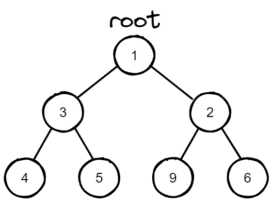
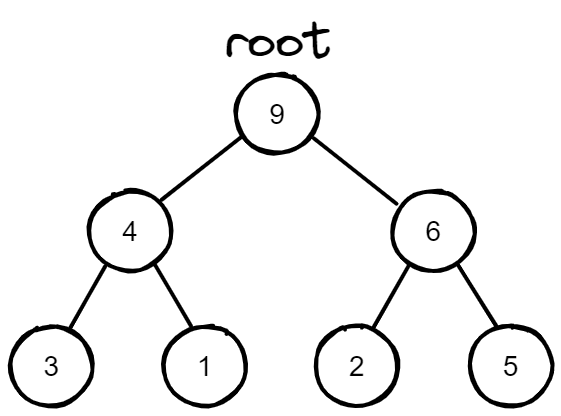

### Priority Queue

들어온 순서에 상관없이, 일정한 기준(우선순위)에 따라 요소들이 나오도록 할 수 있는 Queue.

### Priority Queue 구현 하는 법

원소를 추가할 때 마다, 오름차순 혹은 내림차순으로 알아서 정렬해 주는 **heap**을 통해 priority queue를 구현할 수 있다.

# ☘️ Heap

코딩 테스트에서 힙(heap)을 일일이 구현할 필요가 없다. 이미 잘 만들어진 heap을 잘 활용하는 것이 중요하다.

### heapq

파이썬에서 heap과 관련된 모듈은 haapq로 구현되어 있다.

```
from heapq import heapify, heappop, heappush
```

### heap의 선언

heap의 선언은 상당히 간단하다. 비어있는 heap에서 시작하고 싶으면, 단순히 리스트를 선언하는 것과 같이 하면 된다.

```
heap = []
```

### heapq.heapify() - heap 만들기

이미 존재하는 리스트를 heap으로 만들고 싶으면 <code>heapify</code>를 사용합니다.

```
from heapq import heapify

a = [3, 5, 2, 1, 6, 4]
heapify(a)
```

### heapq.heappush() - heap의 원소 추가

```
heappush(a, 0)
```

### heapq.heappop() - heap의 원소 삭제

heapq는 **min heap**으로 힙 자료구조를 만듭니다. 따라서 <code>heappop()</code> 을 사용하면, **제일 작은** 원소가 <code>pop</code>된다.

### heap의 정의

heap은 min heap과 max heapd으로 나누어져 있다. 각각의 정의는 아래와 같다.

- min heap: 부모 노드의 값 <br 자식 노드 값 트리 형태의 자료구조
- max heap: 부모 노드의 값 > 자식 노드의 값 트리 형태의 자료구조

**min heap**


**max heap**


- heap은 완전 이진 트리(Complete Binary Tree) 형식을 배열, 파이썬에서는 리스트 형태로 나타낸 것이다.
- 즉, 자식 노드들은 <code>node.left</code>, <code>node.right</code>로 표현하는 것이 아니라, list의 index를 활용합니다. 부모노드가 <code>i</code> index라고 하면, 왼쪽 자식노드는 <code>2i+1</code>index에, 오른쪽 자식노드는 <code>2i+2</code>index에 위치한다.

> ❗️ heap은 정렬이 완료된 자료구조가 아니다.
> min heap으로 만들었을 때, a[0]은 항상 제일 작은 값이지만, 그 이후로부터는 알 수 없다.
> max heap의 경우도 마찬가지로 a[0] 은 항상 가장 큰 값을 가지지만, a[1] 이 2번째로 큰 값이라고 확신할 수 없습니다.

<br/>

#### min heap을 구현하는 경우에는 list에 <code>heapify</code>를 이용하면 되지만, max heap을 구현하는 경우에는 아래와 같다.

<br/>

### max heap 구현하기

1. 각 원소에 -1 곱해주기

```
a = [5, 3, 9, 4, 1, 2, 6]
a = [-5, -3, -9, -4, -1, -2, -6]
```

2. heapify 를 사용하여, heap을 만들어 주기
3. heappop을 할때, 다시 -1을 곱하여 출력해 주면 [9, 4, 6, 3, 1, 2, 5]의 순으로 출력된다.

```
value = -1 * heappop(a)
```

### Heap의 시간복잡도

| 메서드                | 시간복잡도           |
| --------------------- | -------------------- |
| <code>heapify</code>  | <code>O(n)</code>    |
| <code>heappush</code> | <code>O(logn)</code> |
| <code>heappop</code>  | <code>O(logn)</code> |

### Heap 코딩테스트 활용법

#### 다익스트라 알고리즘에 사용

다익스트라 알고리즘을 구현할 때, 우선순위 큐를 사용해서 구현한다.

#### 반복적으로 최댓값 혹은 최솟값 하나를 찾아야하는 경우

- heap을 통해 우선순위 큐를 구현해서 최댓값 혹은 최솟값만을 얻어 빠르게 문제를 해결할 수 있다.
