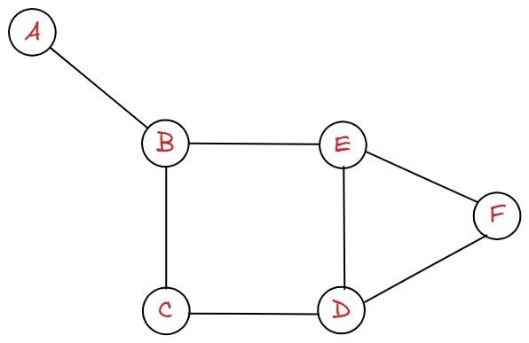

#### 인접 리스트

- **인접리스트 구현 방법**

  ```mermaid
  graph LR
  0-->1
  1-->0
  ```

  1. 딕셔너리
     ```
     {
       0 : 1
       1 : 0
     }
     ```
  2. 리스트의 리스트 구조로 만들 수 있다.

     ```
     [[1], [0]]
     ```

<br />

- 만약 아래와 같이 노드의 값이 A, B, C 와 같이 **string**인 경우에는 1번 딕셔너리 방법을 이용하는 것이 편리해 보인다.
  <br/>
  

  ```
  graph = {
    "A": ["B"],
    "B": ["A", "C", "E"],
    "C": ["B", "D"],
    "D": ["C", "E", "F"],
    "E": ["B", "D", "F"],
    "F": ["D", "E"],
  }
  ```

- 만약 노드의 값이 0, 1, 2 와 같이 number라면 **2번** 방법을 이용하여 리스트의 index를 이용하는 것도 생각해 볼 수 있을것 같다. (물론, 딕셔너리를 사용해도 된다.)

  - 실제로 위상 정렬은 DAG 그래프의 노드를 나열하는데 사용되는데 이때는 2의 방법을 이용한다.
  - 아래의 DAG 그래프라면
    ```mermaid
      graph LR
      0-->1
      1-->2
      1-->3
      3-->4
    ```

  <br/>

  ```
  # [u, v] = v -> u

  prerequisites = [[1, 0], [2, 1], [3, 1], [4, 3]]
  graph = [[] for _ in range(5)]

  for u, v in prerequisites:
    graph[u].append(v)

  # 결과
  [
    [1],
    [2, 3],
    [],
    [4],
    []
  ]
  ```
