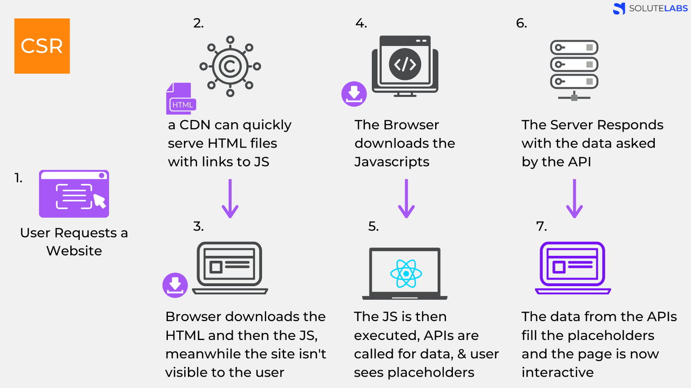
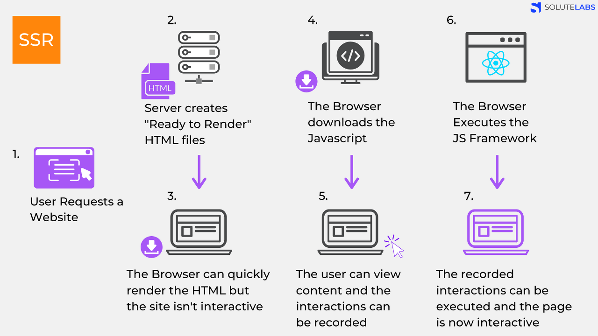

# CSR(Client Side Rendering)

- 렌더링이 클라이언트 쪽에서 일어난다.
- 서버는 요청을 받으면 클라이언트에 HTML과 JS를 보내준다.
- 클라이언트는 이를 받아 렌더링을 시작한다.

  

1. User가 Website에 요청을 보냄
2. (aws의 cloudflare를 생각하면 됨. 엔드 유저의 요청에 '물리적'으로 가까운 서버에서 요청에 응답하는 방식) CDN은 JS 링크가 포함된 HTML 파일을 제공할 수 있습니다.
3. 브라우저는 HTML를 다운 받고 다음으로 JS를 다운 받는다. (유저는 아직 아무것도 볼 수 없다.)
4. 다운이 완료된 JS가 실행된다. 데이터를 위한 API들이 호출됩니다. 이때 유저는 placeholder를 볼 수 있다.
5. 서버가 API 요청에 응답한다.
6. API로 받아온 data를 placeholder 자리에 넣어주면 페이지는 상호작용이 가능해진다.

서버에서 다른 처리 없이 클라이언트로 보내주기 때문에 자바스크립트가 모두 다운 되고 실행이 끝나기 전까지 사용자는 볼 수 있는 게 없다는 특징을 가지고 있습니다.

# SSR(Server Side Rendering)

- 서버쪽에서 렌더링 준비를 끝마친 상태로 클라이언트에 html 파일을 전달하는 방식

  

1. User가 Website 요청을 보냄.
2. Server는 ‘Ready to Render’ 즉, 즉시 렌더링 가능한 html 파일을 만든다. (리소스 체크, 컴파일 후)
3. 클라이언트에 전달되는 순간, HTML은 즉시 렌더링 된다. 조작은 불가능한 상태
4. 클라이언트가 자바스크립트를 다운받는다.
5. 다운 받아지고 있는 사이에 유저는 컨텐츠는 볼 수 있지만 사이트를 조작할 수는 없고 사용자의 조작은 기억해놓는다.
6. 브라우저가 자바스크립트 프레임워크(ex React)를 실행한다.
7. 기억하고 있던 사용자 조작이 실행되고 웹 페이지는 상호작용이 가능해진다.

## CSR과 SSR 차이

1. 웹페이지를 로딩하는 시간

웹 페이지 로딩의 종류는 두 가지로 나눌 수 있다.

- 웹 사이트의 가장 첫 페이지를 로딩하는 것
- 나머지를 로딩하는 것

첫 페이지 로딩 시간

- CSR의 경우 HTML, CSS와 모든 스크립트들을 한 번에 불러온다. 반면 SSR은 필요한 부분의 HTML과 스크립트만 불러오게 된다.
- 평균적으로 SSR이 더 빠르다.

나머지 페이지 로딩 시간

- 첫 페이지를 로딩한 후, 사이트의 다른 곳으로 이동하는 식의 동작을 가정하자. CSR은 이미 첫 페이지 로딩할 때 나머지 부분을 구성하는 코드를 받아왔기 때문에 빠르다.
- 반면, SSR은 첫 페이지를 로딩한 과정을 정확하게 다시 실행한다. 그래서 더 느리다.

2. SEO 대응

검색 엔진은 자동화된 로봇인 '크롤러'로 웹 사이트들을 읽는다.

- CSR은 자바스크립트를 실행시켜 동적으로 컨텐츠가 생성되기 때문에 자바스크립트가 실행 되어야 metadata가 바뀐다. (이전 크롤러들은 자바스크립트를 실행시키지 않았었기에 SEO 최적화가 필수적이었지만, 구글이 그 트렌드를 바꾸고 있다고 함)
- SSR은 애초에 서버 사이드에서 컴파일되어 클라이언트로 넘어오기 때문에 크롤러에 대응하기 용이하다.

3. 서버 자원 사용

- 매번 서버에 요청을 하기 때문에 SSR이 서버 자원을 더 많이 사용한다.
- CSR은 클라이언트에 일감을 몰아주기 때문에 서버에 부하가 적다

##### 민우님 SPA, MPA, CSR, SSR 정리 내용

[✨ SPA vs MPA, CSR vs SSR](https://velog.io/@minw0_o/SPA-vs-MPA-CSR-vs-SSR)
